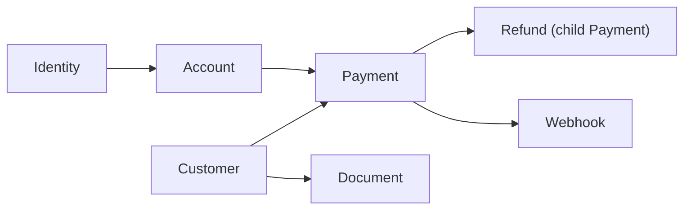
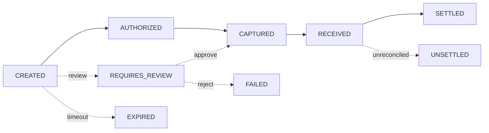

---
layout:
  width: default
  title:
    visible: true
  description:
    visible: false
  tableOfContents:
    visible: true
  outline:
    visible: true
  pagination:
    visible: true
  metadata:
    visible: true
  tags:
    visible: true
description: Core concepts and how they relate — Identity, Account, Payment, Customer, Document.
---

# Concepts

The `conomy_hq` platform is built around a small set of entities that map directly to the API surface. Understanding how they relate is the fastest path to a clean integration.

---

## Entity map

* **Identity** owns one or more **Accounts**.
* **Accounts** are the internal balance ledgers that pay-ins fund and pay-outs draw from.
* **Payments** move funds between an Account and an external rail (or between two Accounts on internal types).
* **Customers** are the end users on whose behalf a payment moves. Documents attached to a Customer drive the [compliance review gate](../compliance/README.md).
* **Refunds** are child Payments linked to a parent via `parentPaymentId`. The parent stays `SETTLED`.
* **Webhooks** notify your integration when a Payment or Customer changes state.

---

## Quick definitions

| Concept | Lives in | Created via |
| --- | --- | --- |
| Identity | Tenant scope | `POST /identities` |
| Account | Inside an Identity | `POST /accounts` |
| Customer | Tenant scope | `POST /customers` (or auto-created on first matching topup) |
| Payment | Tenant scope | `POST /payments` |
| Refund | Child of Payment | `POST /payments/{id}/refund` |
| Document | Inside a Payment or Customer | `POST /payments/{id}/documents` or `POST /customers/{id}/documents` |

For the full vocabulary, see [Glossary](glossary.md).

---

## Lifecycle in one diagram

Every Payment progresses through this state machine. See [Payment status](../payments/transaction-status.md) for what each transition means and which webhook fires on each step.

---

## Where to go next

* [Payment structure](../payments/payment-structure.md) — fields and required values.
* [Origins and destinations](../payments/origins-and-destinations/README.md) — rails available per country.
* [Compliance](../compliance/README.md) — review gate, customer levels, supported documents.
* [Quickstart](../quickstart/introduction.md) — first request in under an hour.
