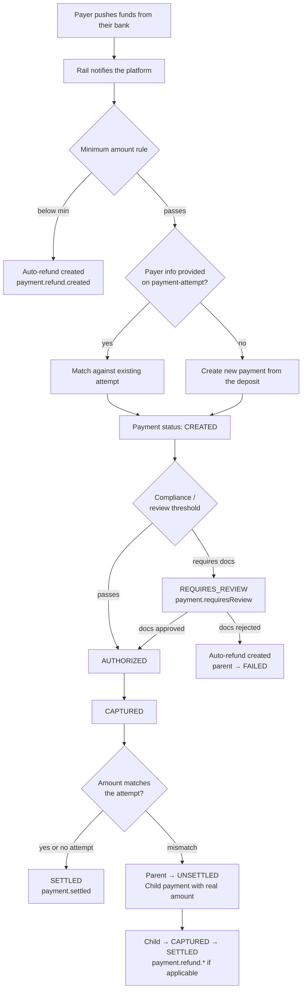

---
layout:
  title:
    visible: true
  description:
    visible: false
  tableOfContents:
    visible: true
  outline:
    visible: true
  pagination:
    visible: true
description: Asynchronous deposit flow shared by push-initiated rails (CVU, CVU Alias, PIX, QR, and similar push-payment methods).
---

# Push deposits

A **push deposit** is any payment where the payer initiates the transfer from their own banking app and the funds arrive on the platform **asynchronously**. The payer is in control of when the money leaves — the platform does not pull the funds. This document describes the full lifecycle shared by every push-style rail (CVU, CVU Alias, PIX, QR, and similar).

If you are collecting via a pull-style rail (card, direct-debit, crypto withdrawal, SWIFT/SEPA pay-out on your side) this document does not apply — see the regular [payment lifecycle](transaction-status.md).

## Rails covered

The same flow is applied, with rail-specific field names, to every push rail supported by the platform. Today that includes:

| Rail | Country | Currency | Node |
| --- | --- | --- | --- |
| CVU | Argentina | ARS | [`CVU`](origins-and-destinations/nodes/cvu.md) |
| CVU Alias | Argentina | ARS | [`CVU`](origins-and-destinations/nodes/cvu.md) |
| PIX | Brazil | BRL | [`PIX`](origins-and-destinations/nodes/pix.md) |

Anything new you enable under this model (QR-only rails, other LATAM push methods) will inherit the same state machine — no integration changes on your side.

## Dedicated vs dynamic identifier

Every push rail supports two allocation modes for the destination identifier (the CVU number, the PIX key, the QR code):

| | **Dedicated** (aka fixed / static) | **Dynamic** |
| --- | --- | --- |
| Lifetime | Long-lived identifier assigned to the merchant. Shared across payers. | Generated for a single payment intent. |
| Traceability | No 1:1 link to a prior intent. The deposit is matched by amount + payer info when available. | Strict 1:1 link to the payment you pre-registered. |
| Typical use | Recurring inflow, off-platform checkout, merchant inbox for multiple payers. | Checkout flow where amount + payer are known up-front. |
| Underpaid / overpaid detection | When you provide `expectedAmount` on assignment (CVU) or when payer info matches (PIX). | Automatic: received amount is compared to the pre-registered amount. |

You can mix both modes on the same integration. The platform decides how to process each incoming deposit based on which identifier it arrived on.

## Pre-registering a deposit (payment-attempt)

Whenever you know something about the payment up-front — the amount, the payer, the destination account — you should pre-register it with a **payment-attempt**:

```http
POST /payment-attempts
```

A payment-attempt is the same object as a payment but created in the `ATTEMPT` status. It does two things:

1. Reserves the intent on the platform so when the deposit arrives we can match it.
2. Lets you pass **payer information** (`firstName`, `lastName`, `documentNumber`, `email`) which drives underpaid/overpaid classification and improves conversion.

> In the API reference and in most of this documentation, "payment-attempt" and "create payment" refer to the same endpoint family — `POST /payment-attempts` creates the attempt, `POST /payments` creates the definitive payment from it. Either term in your system logs is fine as long as you use `POST /payment-attempts` for the initial creation on push rails.

If you do not provide payer information, the platform will still process the deposit when it arrives — it just cannot pre-match it. Matching then happens after the funds land, using the rail-level payer identifier (the sender CVU/CBU, the PIX key, etc.).

## Lifecycle

The following state machine is applied to every push deposit regardless of rail:



The states used here are the same ones documented in [Payment status](transaction-status.md). What this flow adds is *when each transition happens* for a push-initiated deposit.

## Step by step

### 1. Minimum amount check

The platform rejects any deposit below the per-client, per-currency minimum amount before creating a payment. When this happens:

- No payment is created for the deposit.
- The platform automatically issues a **refund** back to the sender via the rail.
- You receive `payment.refund.created`, then `payment.refund.captured`, then `payment.refund.settled` (or `payment.refund.failed` if the reversal cannot be completed).

Minimum amounts are configured per client per currency. Contact your integration partner to set or change them.

### 2. Payer-info match

If you pre-registered a `payment-attempt` with payer information and the rail provides a matching sender:

- The attempt is promoted to `CREATED` with the real received amount and payer details.
- No duplicate payment is created.

If you did **not** provide payer info, or the sender cannot be matched, a fresh payment is created with all the information we received from the rail.

### 3. Compliance check

The platform runs the compliance rules configured for your client (amount threshold, documentation requirements, …). Two outcomes:

- **Passes** → payment transitions to `AUTHORIZED`, then `CAPTURED` automatically for push rails (no separate capture step needed).
- **Requires documentation** → payment moves to `REQUIRES_REVIEW` and you receive `payment.requiresReview`. Upload the required documents via [`POST /payments/{id}/documents`](../api-reference/payments/payments.md) — the [Review flow](review-flow.md) guide covers the upload styles.

You do not need to call a capture endpoint for push deposits — the platform captures the payment internally as soon as the compliance gate clears.

### 4. Assignment (optional)

For **dedicated** CVU deposits only, the final step is to pick which merchant account the funds should land in. Call:

```http
POST /payments/{id}/assign
```

See [`POST /payments/{id}/assign`](../api-reference/payments/payments.md#assignment-cvu-deposits) for the body shape. When `expectedAmount` is included, the platform classifies the deposit as `PAID` / `UNDERPAID` / `OVERPAID` (see amount mismatch below).

For dynamic identifiers and for PIX, no explicit assignment is needed — the destination account was recorded when the payment-attempt was created.

### 5. Final states

- **Happy path, no payer match.** Funds go to `SETTLED`; available-funds balance on the destination account is increased; you receive `payment.settled`.
- **Happy path, payer matched and amount matches.** Same as above — the pre-registered attempt reaches `SETTLED` and you receive `payment.settled`.
- **Amount mismatch.** See the next section.

## Amount mismatch (under/overpaid)

Whenever the received amount differs from what you registered on the attempt (or the `expectedAmount` on assignment), the platform splits the payment into two linked transactions:

1. The **parent** — the payment you originally registered — transitions to `UNSETTLED` and is **not** added to the available balance.
2. A **child payment** is created with the **real received amount** and is run through the normal lifecycle (`CAPTURED` → `SETTLED`).
3. You receive `purchase.underpaid` or `purchase.overpaid` with `relatedPaymentId` / `childPaymentId` pointing at the child.

This lets you accept duplicate and mis-sized deposits cleanly:

- `relatedPaymentId` and `childPaymentId` in the assign response (and in the `purchase.underpaid` / `purchase.overpaid` webhook payload) both point at the child. Either is fine to use as a lookup key.
- Check the child's status (not the parent's) for the final outcome of the actual funds received. The parent stays `UNSETTLED` for audit.

## Refunds

Every automatic refund emitted by the flow above — below-minimum, review-rejected, window-expired — produces a child transaction with `type=REFUND` and the same lifecycle as any other payment. You receive the full chain of webhooks:

| Event | Meaning |
| --- | --- |
| `payment.refund.created` | Child refund was created on our side. |
| `payment.refund.captured` | The rail accepted the reversal request. |
| `payment.refund.settled` | The sender received the money back. Terminal. |
| `payment.refund.failed` | The rail could not complete the reversal. Terminal; you may need to reconcile manually. |

You can also issue a refund on any `SETTLED` push-deposit payment yourself via [`POST /payments/{id}/refund`](../api-reference/payments/payments.md#refunds).

## Webhooks summary

The full set of webhooks you may observe on a push deposit:

| Webhook | When it fires |
| --- | --- |
| `purchase.attempted` | You created a payment-attempt on a push rail. |
| `purchase.pendingAssignment` | Deposit is waiting for `POST /payments/{id}/assign` (dedicated CVU only). |
| `payment.requiresReview` | Compliance gate needs documentation. |
| `payment.reviewApproved` | Operator approved the attached documents. |
| `payment.reviewRejected` | Operator rejected the documents; a refund is issued. |
| `payment.settled` | Funds reached final reconciled state on the destination account. |
| `payment.expired` | Deposit window elapsed without assignment; a refund was issued. |
| `payment.unsettled` | Received but cannot be reconciled (for example, amount mismatch — see above). |
| `purchase.underpaid` / `purchase.overpaid` | Fires alongside `payment.unsettled` when the mismatch spawned a child. |
| `payment.refund.created` / `captured` / `settled` / `failed` | Refund child lifecycle. |

For the payload shape see [Webhooks](../api-reference/payments/webhooks.md).

## Notifying you when a customer hits a limit

Compliance limits (per-customer monthly amount, per-customer count, KYC level) are evaluated on every incoming deposit. When a customer is about to hit or has hit a limit you receive `customer.levelChanged` — stop routing deposits for that customer until you resolve the case (upload documents, bump the KYC level, or stop accepting funds from them).

See [Customers](../api-reference/customers.md) for the customer model.

## FAQ

**Do I need to capture the payment manually?**
No. The platform drives the lifecycle as the rail reports back — `AUTHORIZED` → `CAPTURED` → `RECEIVED` → `SETTLED` happen automatically. You only react through webhooks.

**Should I rely on `relatedPaymentId` or `childPaymentId`?**
They point at the same transaction (the child) in responses and webhooks. Either works; we recommend `relatedPaymentId` because the same field is used in the webhook payload.

**What status means "the money is in"?**
`SETTLED` on the child (when there was a mismatch) or on the payment itself (when it settled directly). `CAPTURED` means the compliance gate cleared but final reconciliation has not happened yet.

**Can I disable the review / source-of-funds step?**
Compliance thresholds are configured per client. If your vertical lets you skip source-of-funds evidence, your integration partner can remove that gate — the flow then goes straight from `AUTHORIZED` to `CAPTURED` without ever entering `REQUIRES_REVIEW`.
